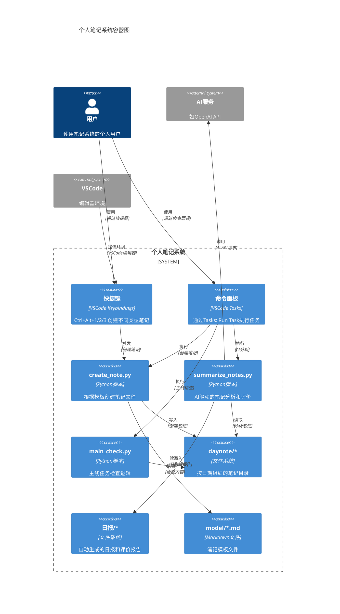
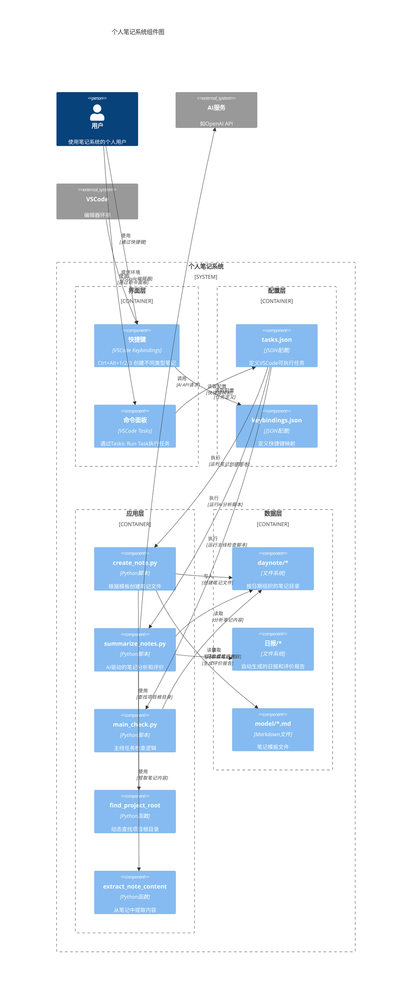
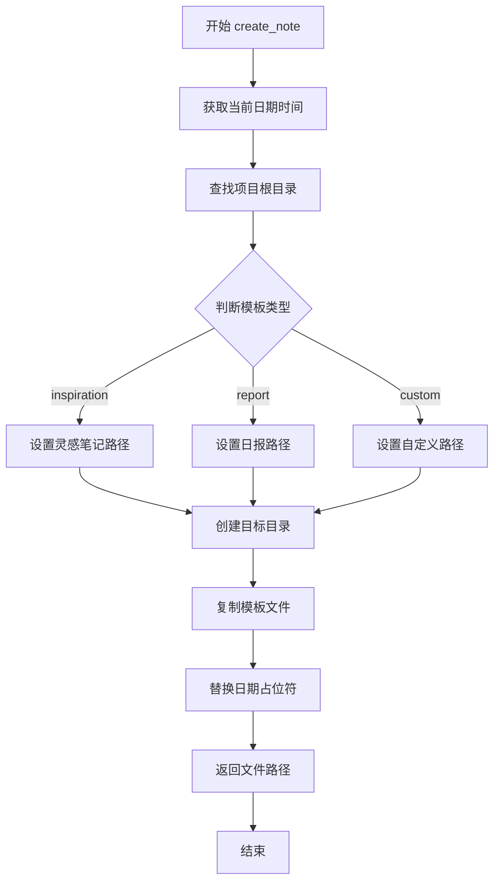
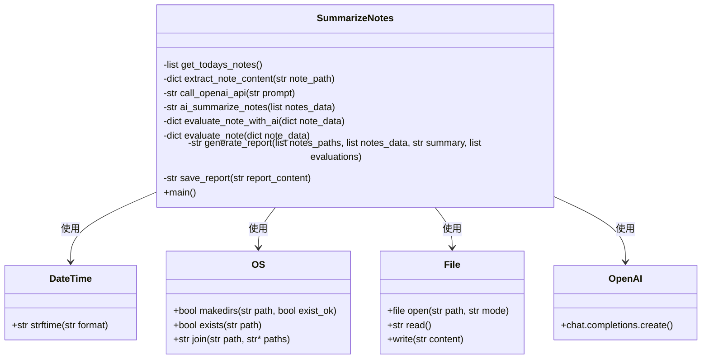
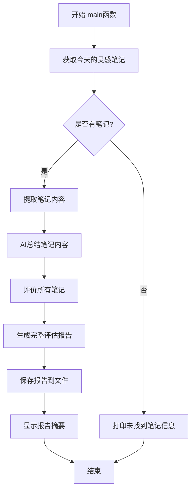
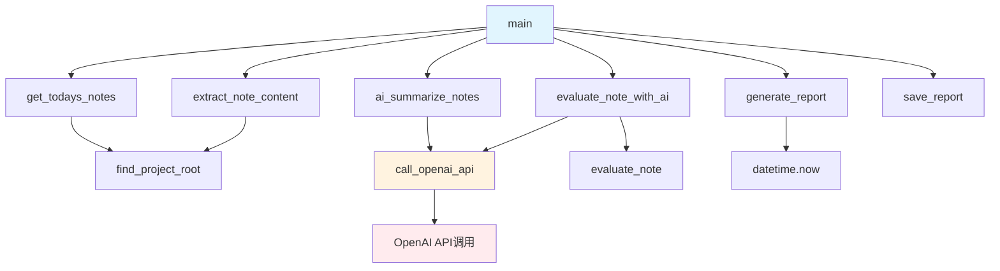
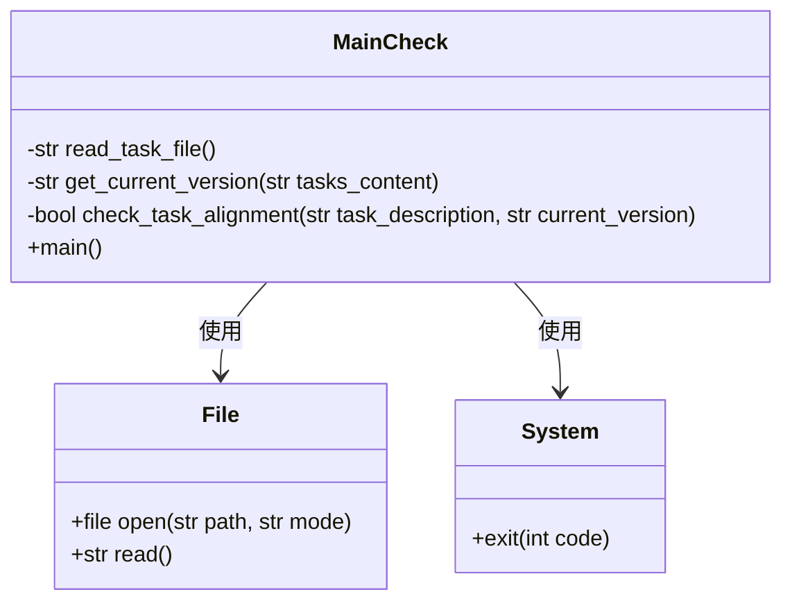

# 个人笔记系统详细设计文档

## 1. 文档信息

- **文档版本**: 1.0
- **编写日期**: 2025-12-30
- **项目名称**: 个人笔记系统
- **编写人员**: [套用表]

## 2. 项目概述

### 2.1 项目目标
个人笔记系统是一个基于VSCode的笔记管理工具，旨在帮助用户高效记录日常工作、自动生成日报以及评估工作状态。系统通过模板化笔记创建、AI驱动的笔记评价等功能，提升个人知识管理效率。

### 2.2 核心功能
- 自动创建日期目录
- 模板化笔记创建
- 快捷键操作
- AI驱动的笔记汇总与评价
- 主线任务检查机制

## 3. 系统架构

### 3.1 C4组件图

```mermaid
C4Context
title 个人笔记系统上下文图

Person(user, "用户", "使用笔记系统的个人用户")
System_Boundary(noteSystem, "个人笔记系统") {
    System(aiService, "AI服务", "如OpenAI API")
    System(editor, "VSCode", "编辑器环境")
}

Rel(user, noteSystem, "使用", "通过快捷键和命令面板")
Rel(noteSystem, aiService, "调用", "用于AI分析和评价")
Rel(noteSystem, editor, "集成于", "VSCode扩展环境")
```






## 4. 核心模块详细设计

### 4.1 笔记创建模块 (create_note.py)

#### 4.1.1 模块功能
- 根据模板类型创建笔记文件
- 自动创建日期目录
- 替换模板中的日期占位符


#### 4.1.3 主要函数设计

**find_project_root()**
- **功能**: 动态查找项目根目录
- **输入**: 无
- **输出**: 项目根目录路径
- **逻辑**: 从当前脚本位置向上查找包含README.md的目录

**create_note(template_type)**
- **功能**: 根据模板类型创建笔记
- **输入**: template_type (模板类型: inspiration, report, 或自定义)
- **输出**: 创建的文件路径
- **逻辑**: 
  1. 获取当前日期和时间
  2. 根据模板类型确定路径和文件名
  3. 创建目标目录
  4. 复制模板文件
  5. 替换日期占位符

#### 4.1.4 流程图



### 4.2 AI笔记评价模块 (summarize_notes.py)

#### 4.2.1 模块功能
- 收集当天的灵感笔记
- 使用AI对笔记进行总结
- 基于综合评价标准对笔记进行评分
- 生成评价报告

#### 4.2.2 类图



#### 4.2.4 逻辑流程图



#### 4.2.5 函数调用关系图



#### 4.2.3 主要函数设计

**get_todays_notes()**
- **功能**: 获取今天的全部灵感笔记
- **输入**: 无
- **输出**: 今天所有灵感笔记文件路径的列表
- **逻辑**: 
  1. 获取今天的日期
  2. 检查对应日期目录是否存在
  3. 查找所有以"灵感-"开头的笔记文件

**extract_note_content(note_path)**
- **功能**: 提取笔记的核心内容
- **输入**: note_path (笔记文件路径)
- **输出**: 包含各部分内容的字典
- **逻辑**: 
  1. 读取笔记文件内容
  2. 使用正则表达式提取各个部分的内容
  3. 返回包含"创意点"、"遇到的问题"、"解决方案"、"学到的知识"的字典

**call_openai_api(prompt)**
- **功能**: 调用OpenAI API
- **输入**: prompt (发送给模型的提示文本)
- **输出**: 模型返回的结果
- **逻辑**: 
  1. 从环境变量获取API密钥
  2. 创建OpenAI客户端
  3. 调用模型并返回结果

**evaluate_note_with_ai(note_data)**
- **功能**: 使用AI对笔记进行评价
- **输入**: note_data (单条笔记的数据)
- **输出**: 包含各项评分和总分的字典
- **逻辑**: 
  1. 构造AI提示词
  2. 调用AI获取评分
  3. 解析AI返回的评分


### 4.3 主线任务检查模块 (main_check.py)

#### 4.3.1 模块功能
- 检查当前任务是否符合项目主线目标
- 确保开发工作围绕当前版本目标进行

#### 4.3.2 类图



#### 4.3.3 主要函数设计

**read_task_file()**
- **功能**: 读取任务文件内容
- **输入**: 无
- **输出**: 任务文件内容
- **逻辑**: 读取task.md文件内容

**get_current_version(tasks_content)**
- **功能**: 从任务内容中提取当前进行中的版本
- **输入**: tasks_content (任务文件内容)
- **输出**: 当前版本号
- **逻辑**: 解析任务内容，提取进行中的版本

**check_task_alignment(task_description, current_version)**
- **功能**: 检查任务是否与当前版本对齐
- **输入**: task_description (任务描述), current_version (当前版本)
- **输出**: 布尔值，表示是否对齐
- **逻辑**: 检查任务描述中是否包含版本信息

## 5. 数据结构设计

### 5.1 笔记内容结构
```python
content_sections = {
    "创意点": "",
    "遇到的问题": "",
    "解决方案": "",
    "学到的知识": ""
}
```

### 5.2 评价结果结构
```python
scores = {
    "完整性": 0,
    "深度": 0,
    "实用性": 0,
    "创新性": 0,
    "反思性": 0,
    "AI评语": "",
    "总分": 0
}
```

## 6. 接口设计

### 6.1 VSCode任务接口
- **创建灵感笔记**: `create-inspiration-note`
- **创建日报**: `create-report-note`
- **创建自定义笔记**: `create-custom-note`

### 6.2 命令行接口
- **创建笔记**: `python scripts/create_note.py --template [type]`
- **AI评价**: `python scripts/summarize_notes.py`
- **主线检查**: `python main_check.py`

## 7. 部署和配置

### 7.1 依赖库
- `openai`: 用于调用OpenAI API
- `markdownify`: 用于解析markdown内容

### 7.2 环境变量
- `OPENAI_API_KEY`: OpenAI API密钥
- `OPENAI_BASE_URL`: OpenAI API基础URL
- `OPENAI_MODEL`: 使用的模型名称

### 7.3 配置文件
- `.vscode/tasks.json`: VSCode任务配置
- `.vscode/keybindings.json`: 快捷键配置
- `daynote/model/*.md`: 笔记模板

## 8. 错误处理

### 8.1 异常处理策略
- 文件不存在时的处理
- API调用失败时的处理
- 模板解析错误的处理

### 8.2 日志记录
- 关键操作的日志输出
- 错误信息的详细记录

## 9. 性能考虑

### 9.1 优化策略
- 文件操作的批量处理
- AI API调用的并发控制
- 模板解析的缓存机制

## 10. 安全考虑

### 10.1 API密钥安全
- 环境变量存储API密钥
- 不在代码中硬编码密钥

### 10.2 文件权限
- 合理设置文件读写权限
- 防止非法文件访问